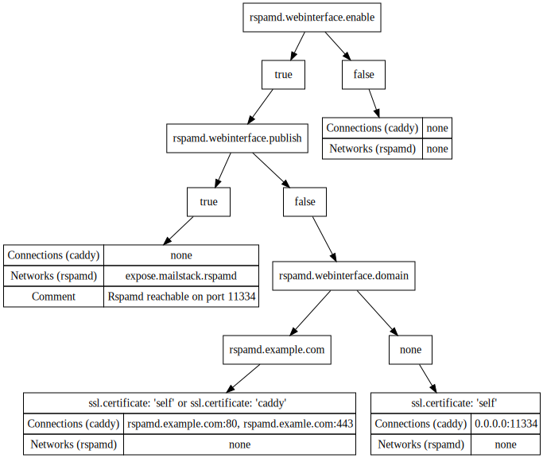

Reference
=========

rspamd
------

Rspamd is a spam filtering system that analyses each message and give it a spam score, furthermore it allows monitoring the mail-traffic.
It uses ``redis-server`` to cache and store internal data. Redis is running in the separate docker-container ``redis``

Controller
~~~~~~~~~~

In order to use the webinterface to monitor emails you have to set the ``rspamd.password`` and ``rspamd.enable_password`` options in the configuration file.
For more information take a look at the `rspamd controller documentation`_. Rspamd recommends ``PBKDF2-Blake2`` as hash algorithm for the passwords but
also supports ``Catena``. In order to generate passwords you can use the management tool, that ships with rspamd. If you don't want to install a ``rspamdadm``
you can use the existing one in the rspamd container to create your passwords.

.. _rspamd controller documentation: https://rspamd.com/doc/quickstart.html#setting-the-controller-password

.. code:: console

  docker run -it --entrypoint "rspamadm" dev.cryptec.at:5000/infrastructure/mailstack/rspamd:master pw -t pbkdf2

Put your hashed password in your ``config.yml`` as following:

.. code-block:: yaml

  rspamd:
    controller:
      password: ""
      enable_password: ""

Don't worry about escaping chars, ``config-management`` will do that for you.

The Webinterface is enabled by default and also served by caddy. To disabled it, simply change ``rspamd.webinterface.enable`` to ``false``.
If you want to use your own reverse proxy, set ``rspamd.webinterface.publish`` to ``true``. Rspamd is then attached to the ``expose.mailstack.rspamd`` network.
Exposing the webinterface directly isn't possible due to security concerns. We strongly advise against running the Webinterface without propper TLS.
If you use caddy as a reverse proxy and certificate source (``ssl.certificate: caddy``) you need to set a valid Domain (``rspamd.webinterface.domain``).
In case the certificate source is set to ``self``, and no domain is specified, caddy exposes rspamd on it's standardport ``11334`` otherwise it'll be published on port ``443``.

Here's a quick example configuration with caddy as the reverse proxy.

.. code-block:: yaml

  rspamd:
    webinterface:
      enable: true
      publish: false
      domain: rspamd.example.com

